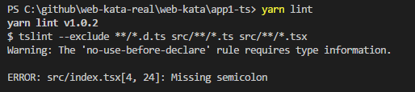

# React App Kata 2 Typescript

Code for **Kata 2 Typescript** is available in the [app2-ts](app2-ts) folder.

## Learning aims

The idea here is understand the concept of a `state` and callbacks in a Typescript React component.

How `state` works and how to modify it.

## Task

Write the Typescript code to:

* Add new products to the listed products
* Be able to remove products from the list of products

**Note:** Remember you can run `yarn lint` as you develop to see all linting errors as you work:

1. Create a new `interface` to define `App` state
    * It should have one field for products, of type `Product[]` present in `/Models/Product.ts`
    * here is an [example in TypeScript react](https://github.com/piotrwitek/react-redux-typescript-guide#stateful-components---class)
1. Move the `products` passed to the `<ProductList>` component to a `state` property in `App.tsx`, and pass `this.state.products` to `<ProductList>` instead
    * [constructors in React](https://facebook.github.io/react/docs/react-component.html#constructor)
    * You'll have to make sure `App` has the correct type for its state
    * Remember to `import { Product } from './Models/Product'`
1. Add a `<form>` to add new products within the `add-product` div. It should contain:
    * `label` for product name
    * `input` for product name
    * `label` for description
    * `input` for description
    * a submit button
1. Add a handler for when `name` and `description` change
    * You'll need to use the `FormEvent<T>` type to handle events, e.g. `function onNameChange(event: React.FormEvent<HTMLInputElement>){...}`, and `event.currentTarget.value`
    * Store this in the components state as the form's state (this will require adding new items to component state interface)
1. Add a handler function for the `onSubmit` event of the form. The function should:
    * Add a new product to the components state, constructing it from  `name` and `description` in the components state
    * Clear the `name` and `description` form state
1. Add a function to remove a product in `App.tsx`
    * You can use the [filter](https://developer.mozilla.org/en-US/docs/Web/JavaScript/Reference/Global_Objects/Array/filter) function available in arrays
1. Make the remove product function available to use in all `<ProductItem>` components and use it when the div with the `remove` class is clicked.
1. Test that you can add products and remove them from the app.

## Resources

* [Typescript React component example](https://github.com/piotrwitek/react-redux-typescript-guide#stateful-components---class)
* [Another Typescript React component example](https://github.com/Microsoft/TypeScript-React-Starter#creating-a-component)
* [Forms](https://facebook.github.io/react/docs/forms.html)
* [Handling Multiple Inputs in Forms](https://facebook.github.io/react/docs/forms.html#handling-multiple-inputs)
* [Constructors in React](https://facebook.github.io/react/docs/react-component.html#constructor)