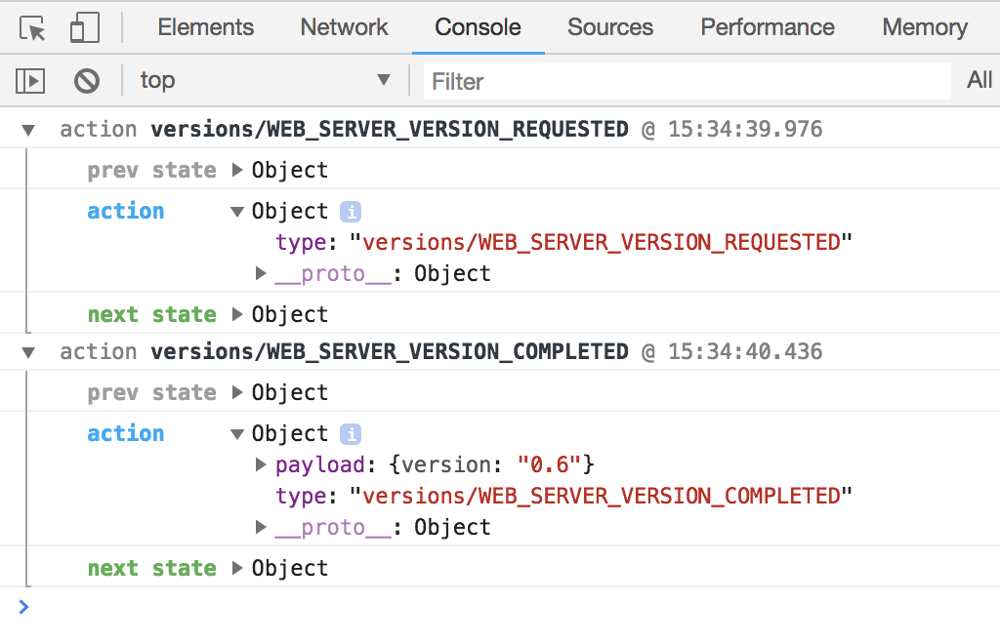

# React App Kata 6 TypeScript

Code for **Kata 6** is available in the [app-ts-6](app-ts-6) folder.

## Learning aims

The idea here is to start using Redux for our app and understand it's main concepts.

## Requirements

* [dotnet core v2.0](https://www.microsoft.com/net/core)

## Get started

You will need **2** terminals

1. Web API server
    * go to `./app-ts-6`
    * verify dotnet version `dotnet --version` is higher than `2.0.0`
    * run `dotnet build`
    * run `dotnet run`

    This should build the web api server and serve it at `http:\\localhost:5000`
1. Web app

* in another terminal
* go to `./app-ts-6/app/`
* follow the instructions in the [README](README.md#run-the-app).
* your app should be running at port **3000**

## Concepts

Let's go through some [basic concepts](https://redux.js.org/docs/basics/) before we start. We have added a simple end to end React Redux example in the code of `app-ts-6` that we will explain first.

1. Actions

    [Actions](https://redux.js.org/docs/basics/Actions.html) are sets of information that are sent to your application.
    An action has a `type` (mandatory) and a `payload` (optional).

    Example of an action with no payload fired:

    ```ts
    dispatch(VersionActions.versionRequested());
    ```

    Example of an action with payload fired:

    ```ts
    dispatch(VersionActions.versionCompleted(version));
    ```

    Here is an example of the definition of `versionRequested` an actions:

    ```ts
    export const VersionActions = {
        versionRequested: createAction(TypeKeys.WEB_SERVER_VERSION_REQUESTED, () => ({
            type: TypeKeys.WEB_SERVER_VERSION_REQUESTED
        })),
    };
    ```

1. Reducers

    [Reducers](https://redux.js.org/docs/basics/Reducers.html) define how the state of our app should change with respect to actions that are fired.

    All of our reducers are combined in `/src/modules/index.ts`

    ```ts
    import { combineReducers } from 'redux';
    import versions, { VersionsState, VersionActionTypes } from './versions';

    interface StoreEnhancerState { }

    export interface RootState extends StoreEnhancerState {
    versions: VersionsState;
    }

    export default combineReducers<RootState>({
    versions,
    });

    type AppAction =
    | VersionActionTypes;

    export type RootAction = AppAction;
    ```

    Our `versions` reducer shows examples of how the state of our app changed based on the actions that are fired:

    `/src/modules/versions.ts`

    ```jsx
    const createEmptyMember = (): VersionsState => ({
        inProgress: false,
        version: undefined,
        error: undefined,
    });

    export default (state = createEmptyMember(), action: VersionActionTypes) => {
        switch (action.type) {
            case TypeKeys.WEB_SERVER_VERSION_REQUESTED:
            return {
                ...state,
                inProgress: true,
            };
            case TypeKeys.WEB_SERVER_VERSION_COMPLETED:
            return {
                ...state,
                inProgress: false,
                version: action.payload.version
            };
            case TypeKeys.WEB_SERVER_VERSION_FAILED:
            return {
                ...state,
                inProgress: false,
                version: undefined,
                error: action.payload.error
            };
            default:
            return state;
        }
    };
    ```

    **Note**:
    Everytime you return an object in the `case` statement of the reducer you are defining the **new state** of that section of the application.

    This means that when you update the state of any reducer you need to do it **without changing the exisitng state**. I.e. use a new object instead of an the existing one.

    That is the reason  why we use the [spread operator](https://developer.mozilla.org/en-US/docs/Web/JavaScript/Reference/Operators/Spread_operator) when returning the new state in each case.

    ```js
    case WEB_SERVER_VERSION_REQUESTED:
      return {
        ...state,
        inProgress: true
      }
    ```

1. Store

    The [store](https://redux.js.org/docs/api/Store.html) contains all the state of your application.

    Ours is defined at `/src/store.js`

    ```ts
    const initialState = {}

    const store: Store<any> = createStore(
        rootReducer,
        initialState,
        composedEnhancers
    );

    export default store;
    ```

    It already uses a `rootReducer` where our app defines the reducers it needs under `/src/modules/index.ts`

    ```jsx
    import rootReducer from './modules'
    ```

1. give access to the store to all components

    To do this we inject in our `src/index.ts` the `store` using the `Provider` component. For more information see: [Passing the Store](https://redux.js.org/docs/basics/UsageWithReact.html#passing-the-store)

    ```jsx
    import * as React from 'react';
    import * as ReactDOM from 'react-dom';
    import './index.css';
    import App from './App';
    import { ConnectedRouter } from 'react-router-redux';
    import { Provider } from 'react-redux';

    import store, { history } from './store';

    ReactDOM.render(
    <Provider store={store}>
        <ConnectedRouter history={history}>
        <App />
        </ConnectedRouter>
    </Provider>,
    document.getElementById('root')
    );
    ```

1. create a dispatch function for fetching versions

    * we define a `fetchWebServerVersion` function in `/src/modules/versions.js`

        ```jsx
        function fetchWebServerVersion() {
            const url = '/api/versions/get';
            return fetch(url, {
                method: 'GET',
                headers: {
                'Accept': 'application/json',
                'Content-Type': 'application/json'
                },
                credentials: 'same-origin'
            }).then(response => {
                if (response.ok) {
                return response.json();
                }
                const error = new Error(response.statusText);
                throw error;
            });
        }

        type VersionThunkAsync = ActionCreator<ThunkAction<Promise<void>, VersionsState, void>>;

        export const fetchVersion: VersionThunkAsync = () => {
            return async (dispatch: Dispatch<VersionsState>): Promise<void> => {
                dispatch(VersionActions.versionRequested());
                await fetchWebServerVersion()
                .then((version: string) => dispatch(VersionActions.versionCompleted(version)))
                .catch(e => {
                    dispatch(VersionActions.versionFailed(e.error));
                });
            };
        };
        ```

        Things to notice here:

        * `fetchWebServerVersion` function returns a Promise.
        * we dispatch `WEB_SERVER_VERSION_REQUESTED` with `dispatch(VersionActions.versionRequested())` action before the fetch call
        * we dispatch `WEB_SERVER_VERSION_COMPLETED` with `dispatch(VersionActions.versionCompleted(version))` action when the fetch call completes

1. Connect your dispatch function and the data present in the store to the `App` component
    * we import fetch function and connect state to props

        ```jsx
        import { Dispatch, bindActionCreators } from 'redux';
        import { connect } from 'react-redux';

        import { RootState, RootAction } from './modules';
        import { fetchVersion } from './modules/versions';

        const mapStateToProps = (state: RootState) => ({
            version: state.versions.version,
        });

        const mapDispatchToProps = (dispatch: Dispatch<RootAction>) => bindActionCreators(
        {
            fetchVersion,
        },
        dispatch);

        export default connect(mapStateToProps, mapDispatchToProps, null, {
            pure: false
        })(App);
        ```

        __Remark 1__: Notice the line `version: state.versions.version` where we connect the data from the store as a property of the component so that it can be used as `this.props.version` directly.

        __Remark 2__: Notice the `mapDispatchToProps`, where we add the `fetchWebServerVersion` function. So that we can call `this.props.fetchWebServerVersion` and that all calls with `dispatch` for example `dispatch(VersionActions.versionRequested())` get properly fired.

    * use the version data present in the `store` in our `App` component

        ```jsx
        <div className='App-header'>
            <h2>Kata 6 - TypeScript - Redux</h2>
            <pre>v{this.props.version}</pre>
        </div>
        ```

1. Check redux actions in the app

    The store we created in `src/store.ts` has a `logger` as one of our middleware as well as `react-router-redux`. This will allow us to check the actions that are fired within the app.

    ```js
    import logger from 'redux-logger';

    const middleware = [
        thunk,
        logger,
        routerMiddleware(history)
    ];
    ```

    If you check you browser console you should see the actions and the change of each state in the store.

    

1. The versions example

    Throughout the Redux concepts we showed how the versions request example work in this app. Have a look at the different pieces to understand how they work:
    * `src/index.ts`
    * `src/App.ts`
    * `src/store.ts`
    * `src/modules/versions.ts`
    * `src/modules/index.ts`

## Task

[Redux](https://redux.js.org) is alredy installed and working in this application. Your goal is to switch the app code into using Redux.

Write the TypeScript/JavaScript/React code to avoid any use of `state` in the `App.tsx` component. Use redux instead

1. move all api calls into the `products` reducer:
    1. under `src/modules` create file called `products.ts` and export an empty reducer.
    1. Connect the reducter to the store by updating `index.ts`.
    1. create the action types for products in `products.ts`
        1. `products/PRODUCTS_REQUESTED`
        1. `products/PRODUCTS_COMPLETED`
        1. `products/PRODUCT_ADD_REQUESTED`
        1. `products/PRODUCT_ADD_COMPLETED`
        1. `products/PRODUCT_REMOVE_REQUESTED`
        1. `products/PRODUCT_REMOVE_COMPLETED`
    1. create and implement all api functions that currently exist in `App.tsx`
        1. `fetchProducts`
        1. `addProduct` (passing `newProduct` as argument)
        1. `removeProduct` (passing `productName` as argument)
    1. be sure each function dispatches a `requested` action before calling the server, and a `completed` action if the request succeeds
1. update the products reducer so that the data of the products list is updated acordingly:
    1. create and implement a case for each action type (requested and completed). Set the products returned from server (if applicable)
1. import all dispatch product functions into `App.tsx`
    1. be sure to map them to props in the `mapDispatchToProps` section
1. use the products data from the store
    1. be sure to map the products data in the `mapStateToProps` section
1. update your `App.tsx` code so that you don't use `this.state` anymore. You shoul be using `this.props` instead
1. check in the browser console that all actions are being fired

## Resources

* [Redux basics](https://redux.js.org/docs/basics/)
